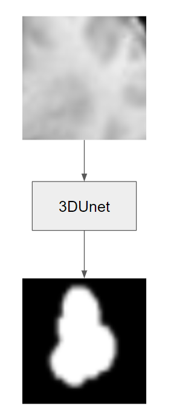
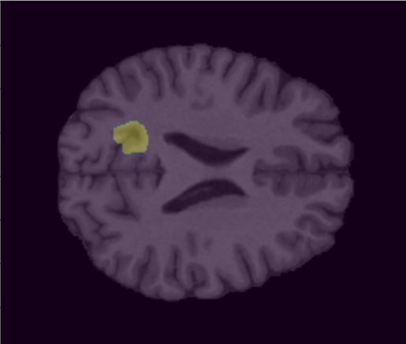
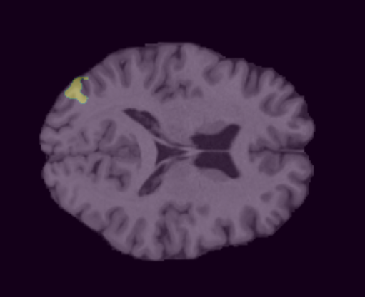
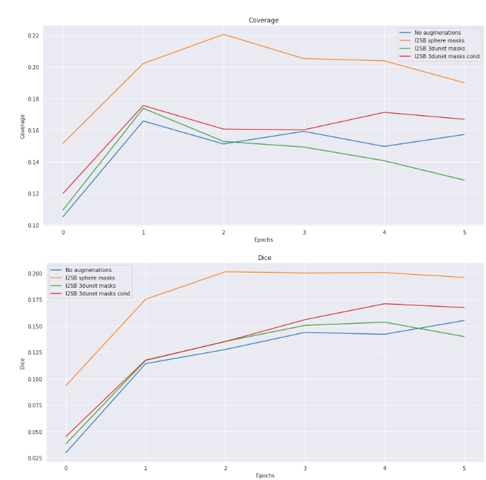
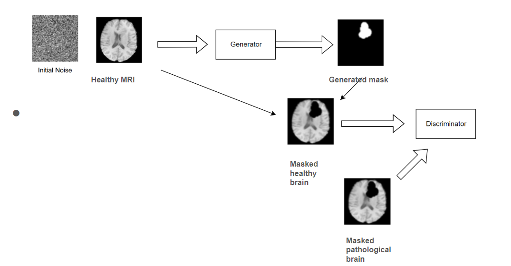

# NeuroML_Team

# Generation of plausible masks of pathology using MRI dataset

## Overview
In this project we build a model which is capable of generating plausible masks of focal-cortical dysplasia pathology for healthy brains MRI. The masks will allow us to generate realistic pathologies via generative models, thereby augmenting dataset of MRI of brains' with FCD.

- Course: Neuroimaging and Machine Learning for Biomedicine, Skoltech, 2024

- Team Members:

    Pavel Bartenev,
    Daria Chekina,
    Mikhail Gubanov

- Supervisor:
    Maxim Sharaev

- TA:
    Nadezhda Alsahanova

Final Presentation: 
[https://docs.google.com/presentation/d/11YScv6lkddbgGMLpUko1wnVR8KmUoLKQpjoZOcd495k/edit#slide=id.p]

## Table of Contents
- [Overview](#overview)
- [Problem Statement](#problem-statement)
- [Results](#results)
- [Running](#running)
- [Setup and Installation](#setup-and-installation)
- [References](#references)
- [Repo structure](#Repo-structure)
  
## Problem statement
The project focuses on generating plausible masks for brain pathology. The main goal is to develop a model that, given a healthy brain MRI scan, generates a mask indicating the plausible shape and size of where a specific pathology could theoretically occur in the scan. These masks will then be used to generate pathologies within healthy brain scans, thereby augmenting the dataset for training pathology segmentation models. The project aims to compare different mask generation strategies based on the segmentation scores of models trained on the augmented dataset. The technique can help make segmentation models more accurate, thus aiding in the automation of pathology detection.

## Methods && Results 
## Proposed method 1
Our idea consists of three main points (figure 3):
1. Train 3D segmentation model on patches with lesion mask in the center;

2. Given a patch of healthy MRI, the model will generate a mask in the center analogous to seen on the train;

3. Additional conditioning on grey/white matter maps can be done.

<kbd align="center">
  
</kbd>
Figure 1. 3DUnet input/output

<kbd align="center">
  
</kbd>

Figure 2. Generated mask a) Not good example

<kbd align="center">
  
</kbd>

Figure 3. Generated mask b) Good example

To evaluate the quality of obtained masks we generated synthetic pathologies on MRI of healthy people using the I2SB inpainting model with obtained masks. After that, the segmentation model was trained on real and synthetic data, Dice and Coverage metrics were measured. The metrics showed that the generated mask performed poorer than simple sphere masks (figure 4). Masks generated by 3DUnet with grey/white matter mask conditioning performed better than the one without conditioning. 

Metrics 3DUnet

<kbd align="center">
  
</kbd>

Figure 4. Losses

## Proposed method 2

To further enhance the quality of pathology mask generation, we propose training a conditional Generative Adversarial Network (figure 5) where the discriminator takes the masked brain images as input. We hypothesize that his approach might help to avoid the issue of differences between healthy and pathological MRI scans. The generator will be trained to create plausible pathology masks, while the discriminator will distinguish between generated and real masks based on the masked brain images. 

<kbd align="center">
  
</kbd>

Figure 5. cGAN architecture

Figure 6. The generated mask with cGAN

## Running
Requirements are provided in requirements.txt. Code is provided in notebooks. Do not hesitate to contact me on the data.
