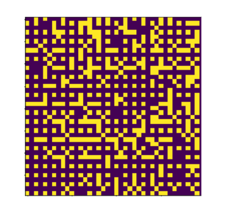

# NeuroML_Team

# Generation of plausible masks of pathology using MRI dataset

## Overview
The main goal of this project is to develop a model capable of producing masks for data that will allow for the augmentation of a dataset with medical images.

- Course: Neuroimaging and Machine Learning for Biomedicine, Skoltech, 2024

- Team Members:

    Pavel Bartenev,
    Daria Chekina,
    Mikhail Gubanov

- Supervisor:
    Maxim Sharaev

- TA:
    Nadezhda Alsahanova

Final Presentation: 
[https://docs.google.com/presentation/d/11YScv6lkddbgGMLpUko1wnVR8KmUoLKQpjoZOcd495k/edit#slide=id.p]

## Table of Contents
- [Overview](#overview)
- [Problem Statement](#problem-statement)
- [Results](#results)
- [Running](#running)
- [Setup and Installation](#setup-and-installation)
- [References](#references)
- [Repo structure](#Repo-structure)
  
## Problem statement
The project focuses on generating plausible masks for brain pathology. The main goal is to develop a model that, given a healthy brain MRI scan, generates a mask indicating the plausible shape and size of where a specific pathology could theoretically occur in the scan. These masks will then be used to generate pathologies within healthy brain scans, thereby augmenting the dataset for training pathology segmentation models. The project aims to compare different mask generation strategies based on the segmentation scores of models trained on the augmented dataset. The technique can help make segmentation models more accurate, thus aiding in the automation of pathology detection.

## Methods && Results 
## Proposed methods 1
Our idea was consist at three main points(figure 3):
1. Train 3D segmentation model on patches with lesion mask in the center;

2. Given a patch of healthy MRI the model will generate a mask in the center analogous to seen on the train;

3. Additional conditioning on grey/white matter maps can be done.

<kbd align="center">
  
</kbd>
Figure 1. Arcitecture of proposed method

<kbd align="center">
  
</kbd>

Figure 2. Generated mask a)Not good example

<kbd align="center">
  
</kbd>

Figure 3. Generated mask b)Good example

Further work consisted in the fact that the generated masks were used to create synthetic pathologies on MRI of healthy people using the I2SB imaging model. After that, the segmentation model was trained on real and synthetic data, Dice and coverage indicators were measured. But the metrics showed that the generated mask performed worse than simple sphere masks(figure 4).Masks generated with 3DUnet with grey/white matter mask performed better than the one without conditioning. 

Metrics 3DUnet

<kbd align="center">
  
</kbd>

Figure 4. Gaphical imaging of training and validation

## Proposed methods 2

To further enhance the quality of pathology mask generation, we propose training a conditional Generative Adversarial Network (figure 5) where the discriminator takes the masked brain images as input. This approach helps to avoid the issue of differences between healthy and pathological MRI scans. The generator will be trained to create plausible pathology masks, while the discriminator will distinguish between generated and real masks based on the masked brain images. By having the discriminator focus solely on the masked brain areas, the model can concentrate on the pathological regions, disregarding variations in healthy tissue, thereby reducing the likelihood of generating false pathologies.

<kbd align="center">
  
</kbd>

Figure 5. Arcitecture of proposed method

Result

<kbd align="center">
  
</kbd>

Figure 6. The generated mask with cGAN

## Running
install requirements.txt with libraries from there. Run the file.
## Setup and Installation

- Clone the repository
git clone 
cd acm_project
- Install the requirements
pip install -r requirements.txt
## References

Songping He, Yi Zou, Bin Li, Fangyu Peng, Xia Lu, Hui Guo, Xin Tan, Yanyan CGaillard F, Sriselvakumar S, Walizai T, et al. Focal cortical dysplasia. Reference article, Radiopaedia.org (Accessed on 25 Oct 2024) https://doi.org/10.53347/rID-10164

Songping He, Yi Zou, Bin Li, Fangyu Peng, Xia Lu, Hui Guo, Xin Tan, Yanyan Chen "An image inpainting-based data augmentation method for improved sclerosed glomerular identification performance with the segmentation model EfficientNetB3-Unet", in Scientifc Reports | 10 January 2024, https://www.nature.com/articles/s41598-024-51651-1

Jiayu Huo, Vejay Vakharia, Chengyuan Wu, Ashwini Sharan, Andrew Ko, Sébastien Ourselin, and Rachel Sparks "Brain Lesion Synthesis via Progressive Adversarial Variational Auto-Encoder", arXiv:2208.03203v1 [cs.CV] 5 Aug 2022

## Repo structure

Files/ : Contains results video and graphics pictures
